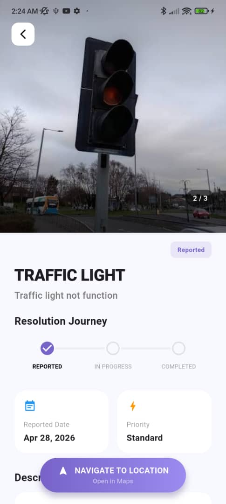
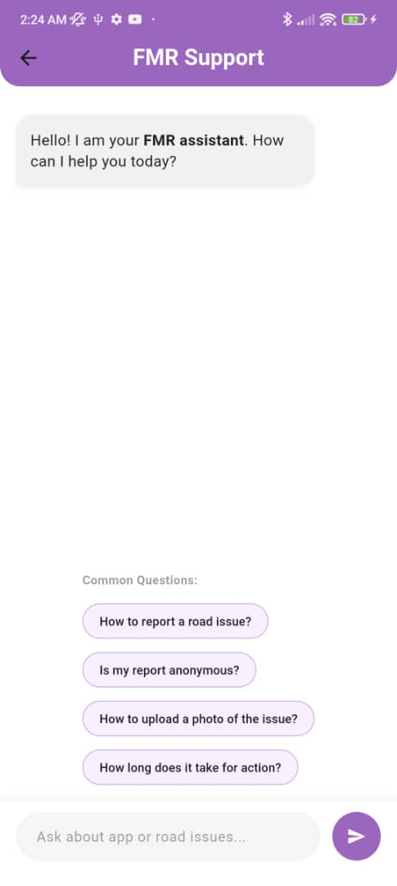
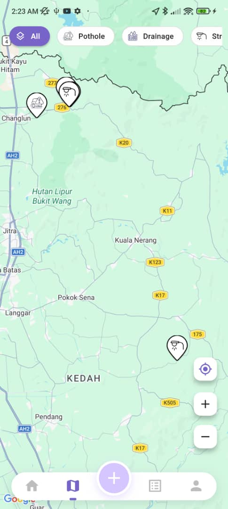
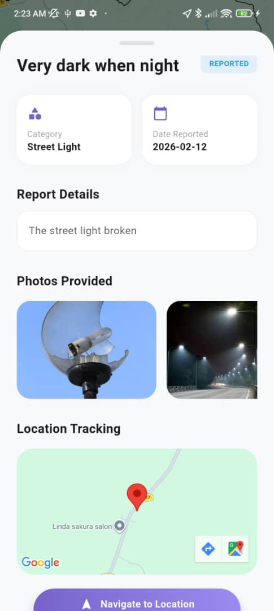
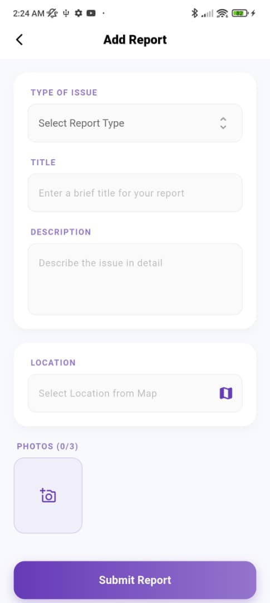
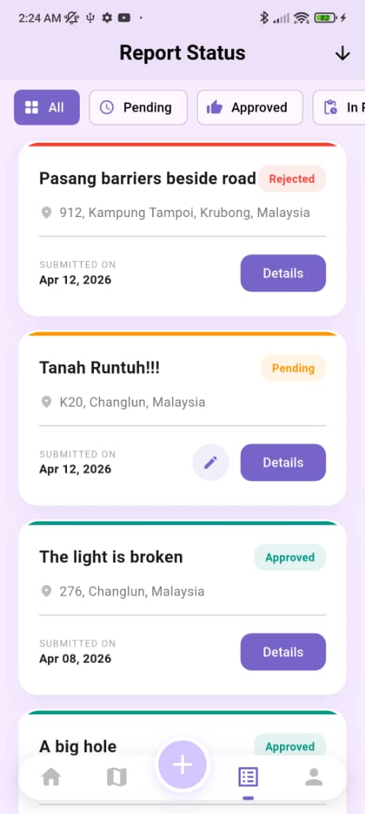

# FIX MY ROAD

A mobile app that can report road and infrastructure issues. Features for the admin side, can refer at [FMRAdmin](https://github.com/St487/FMRAdmin).  
This application provide functions:  
1. Add Report (Which need to provide photos, location and also description)  
2. AI Chatbot about the road issues and apps guidance  
3. Map (Can check the reported issues by others)  
4. Bilingual (Support Eng and Malay)

## Screenshots  

